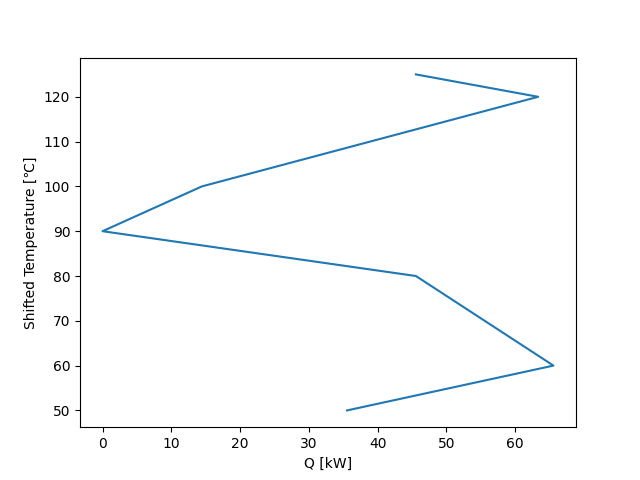
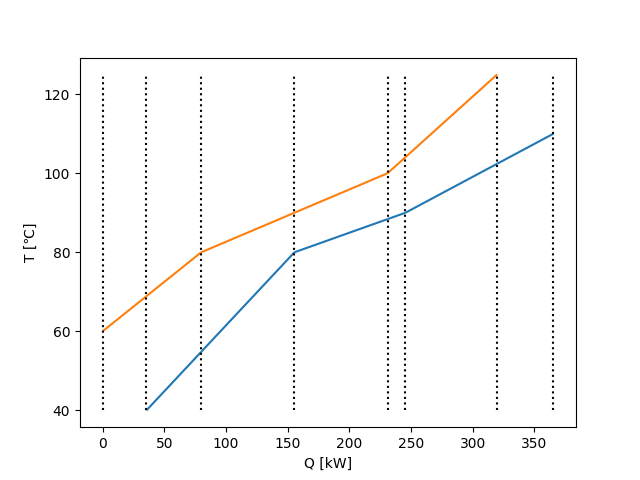
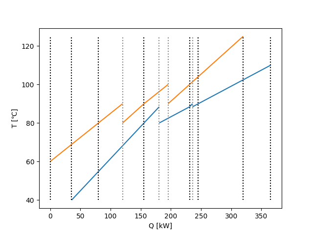
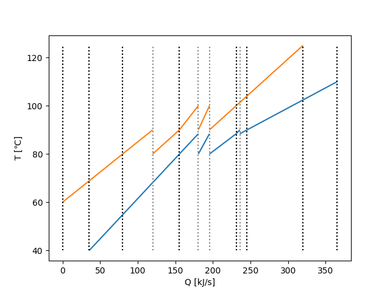
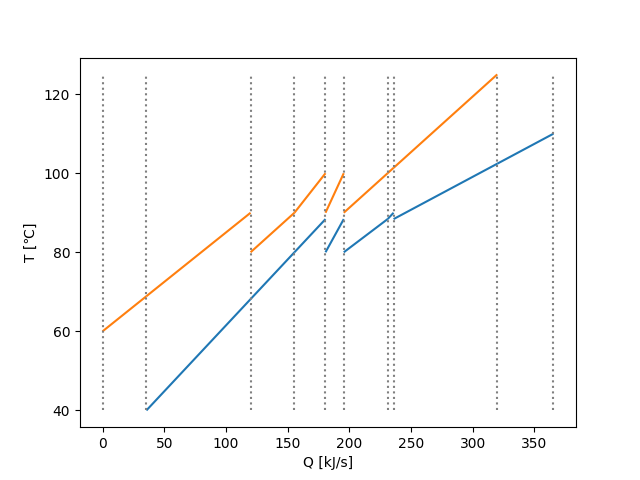

# pyheatintegration

[](https://github.com/tarao1006/pyheatintegration/actions/workflows/test.yml)

ヒートインテグレーションを支援します。グランドコンポジットカーブ、TQ線図の作成に対応しています。

<details>
  <summary>グランドコンポジットカーブ</summary>
  
</details>

<details>
  <summary>TQ線図</summary>
  
</details>

<details>
  <summary>TQ線図(流体ごとに分割)</summary>
  
</details>

<details>
  <summary>TQ線図(流体ごとに分割。最小接近温度差を満たす。)</summary>
  
</details>

<details>
  <summary>TQ線図(結合可能な熱交換器を結合。)</summary>
  
</details>

## Requirements

- Python >= 3.9

## Installation

``` sh
pip install pyheatintegration
```

## Examples

- [simple example](./examples/simple)

## Documentation

https://pyheatintegration.readthedocs.io/en/latest/

## License

MIT
